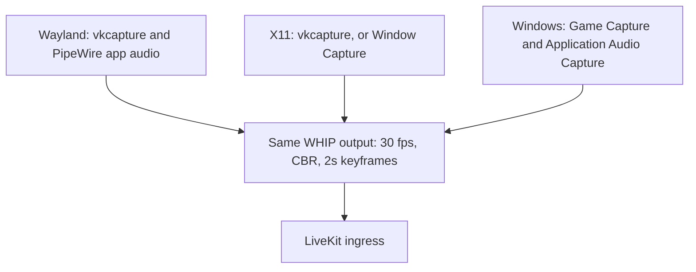

# Capture sources into one output

```mermaid
flowchart TB
  wayland[Wayland: vkcapture and PipeWire app audio]
  x11[X11: vkcapture, or Window Capture]
  windows[Windows: Game Capture and Application Audio Capture]
  whip[Same WHIP output: 30 fps, CBR, 2s keyframes]
  ingress[LiveKit ingress]

  wayland --> whip
  x11 --> whip
  windows --> whip
  whip --> ingress
```

720p30 at about 4 Mbps, or 1080p30 at about 6 Mbps. The operator picks the preset in OBS before Start Streaming.
