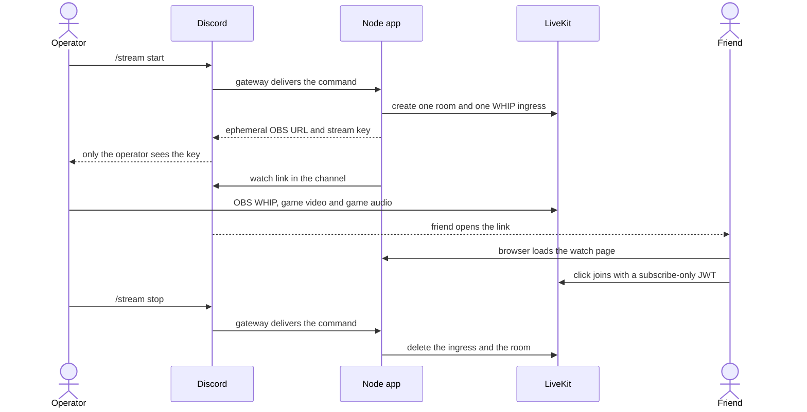

# What one session does

```mermaid
sequenceDiagram
  actor Operator
  participant Discord
  participant Node as Node app
  participant LiveKit
  actor Friend

  Operator->>Discord: /stream start
  Discord->>Node: gateway delivers the command
  Node->>LiveKit: create one room and one WHIP ingress
  Node-->>Discord: ephemeral OBS URL and stream key
  Discord-->>Operator: only the operator sees the key
  Node->>Discord: watch link in the channel
  Operator->>LiveKit: OBS WHIP, game video and game audio
  Discord-->>Friend: friend opens the link
  Friend->>Node: browser loads the watch page
  Friend->>LiveKit: click joins with a subscribe-only JWT
  Operator->>Discord: /stream stop
  Discord->>Node: gateway delivers the command
  Node->>LiveKit: delete the ingress and the room
```
